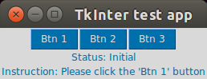
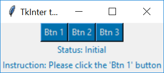

# tk
**Name:** tk<br>
**Description:** Python Tkinter test app repo<br>
**GitHub:** https://github.com/korniichuk/tk

## Table of Contents
* **[Portability](#portability)**
  * **[Ubuntu Desktop 16.04 LTS](#ubuntu-desktop-1604-lts)**
  * **[Windows 10](#windows-10)**
* **[Prerequisites](#prerequisites)**
  * **[Ubuntu Desktop](#ubuntu-desktop)**

## Portability
Python Tkinter test app checked on Ubuntu Desktop 16.04 LTS and Windows 10.
### Ubuntu Desktop 16.04 LTS

### Windows 10


## Prerequisites
### Ubuntu Desktop
[Install tkinter](https://tkdocs.com/tutorial/install.html) Python lib:
```
$ sudo apt-get install python3-tk
```
